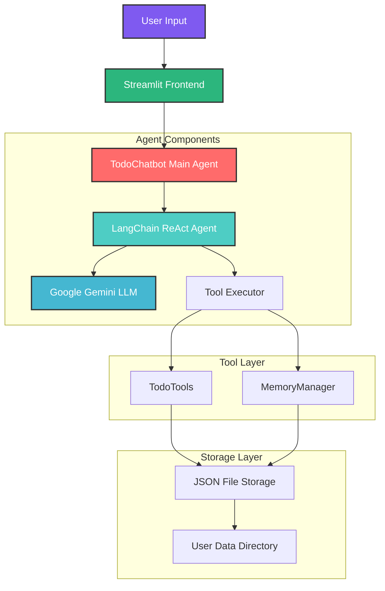

# 🤖 AI Todo Assistant

A conversational AI chatbot that manages personal to-do lists using an agentic architecture with Google Gemini API, LangChain, and Streamlit.

## 🎯 Project Overview

This project implements an intelligent todo assistant that can:
- Hold natural conversations while remembering user context
- Manage personal to-do lists through LLM tool calls
- Persist conversation history and todo data
- Provide a modern, interactive web interface

## 🏗️ Architecture

### System Design



### Component Architecture

```
┌─────────────────────────────────────────────────────────────┐
│                    Streamlit Frontend                        │
│  • Modern dark theme UI                                     │
│  • Real-time chat interface                                 │
│  • Mobile responsive design                                 │
└─────────────────────┬───────────────────────────────────────┘
                      │
┌─────────────────────▼───────────────────────────────────────┐
│                  TodoChatbot Agent                          │
│  • Orchestrates conversation flow                          │
│  • Manages LLM interactions                                │
│  • Handles error recovery                                  │
└─────────────────────┬───────────────────────────────────────┘
                      │
┌─────────────────────▼───────────────────────────────────────┐
│                LangChain ReAct Agent                        │
│  • Reasoning and Acting pattern                            │
│  • Tool selection and execution                            │
│  • Response generation                                     │
└─────────────────────┬───────────────────────────────────────┘
                      │
            ┌─────────┴─────────┐
            │                   │
┌───────────▼─────────┐  ┌─────▼──────────┐
│     TodoTools       │  │ MemoryManager  │
│  • CRUD operations  │  │ • Conversation │
│  • Task validation  │  │ • User profile │
│  • Completion track│  │ • Persistence  │
└─────────────────────┘  └────────────────┘
            │                   │
            └─────────┬─────────┘
                      │
┌─────────────────────▼───────────────────────────────────────┐
│                 JSON File Storage                           │
│  • Conversation history                                    │
│  • Todo lists (active/completed)                          │
│  • User profiles                                          │
│  • Automatic backups                                      │
└─────────────────────────────────────────────────────────────┘
```

## 🔧 Technical Implementation

### 1. Agentic Components

#### **TodoChatbot (main.py)** - Central Agent Orchestrator
- **Role**: Main agent that coordinates all interactions
- **Responsibilities**:
  - Initialize Google Gemini LLM via LangChain
  - Set up ReAct agent with custom tools
  - Manage conversation flow and context
  - Handle error recovery and user interactions

```python
class TodoChatbot:
    def __init__(self, user_id: str = "default"):
        self.memory = MemoryManager(user_id)
        self.todo_tools = TodoTools(self.memory)
        self.llm = self._initialize_llm()
        self.agent_executor = self._setup_agent()
```

#### **LangChain ReAct Agent** - Reasoning and Acting
- **Pattern**: ReAct (Reasoning + Acting) for structured decision making
- **Process**:
  1. **Thought**: Analyze user input and determine required actions
  2. **Action**: Select and execute appropriate tools
  3. **Observation**: Process tool results
  4. **Final Answer**: Generate conversational response

```python
prompt = PromptTemplate.from_template("""
Question: the user's input
Thought: I need to understand what the user wants and decide if I need to use any tools
Action: [tool name if needed]
Action Input: [input for the tool if using one]
Observation: [result from tool if used]
Thought: I now know how to respond to the user
Final Answer: [your conversational response to the user]
""")
```

### 2. Memory Management

#### **MemoryManager (memory_manager.py)** - Persistent Storage Handler
- **Storage Strategy**: JSON-based file system with automatic backups
- **Components**:
  - **Conversation History**: Maintains chat context with timestamp
  - **User Profiles**: Stores user preferences and metadata
  - **Backup System**: Automatic file versioning and corruption recovery

```python
Storage Structure:
user_data/
├── {user_id}_conversation.json    # Chat history
├── {user_id}_profile.json         # User preferences  
├── {user_id}_todos.json          # Todo items
└── backups/                      # Automatic backups
    ├── {user_id}_conversation_backup_*.json
    └── {user_id}_todos_backup_*.json
```

#### **Memory Features**:
- **Context Window**: Maintains last 5 conversation turns for LLM context
- **User Persistence**: Remembers names and preferences across sessions
- **Error Recovery**: Handles corrupted files with automatic backup restoration
- **Conversation Search**: Keyword-based search through chat history

### 3. Tool System

#### **TodoTools (tools.py)** - Task Management Operations
Implements CRUD operations for todo management:

```python
# Tool Registration with LangChain
tools = [
    Tool(
        name="add_todo",
        func=self._safe_add_todo,
        description="Add a new task to the to-do list. Input should be the task description as a string."
    ),
    Tool(
        name="list_todos", 
        func=self._safe_list_todos,
        description="List all current tasks in the to-do list. No input required."
    ),
    Tool(
        name="remove_todo",
        func=self._safe_remove_todo,
        description="Remove a task from the to-do list. Input can be task number (1, 2, 3...) or partial task description."
    ),
    Tool(
        name="complete_todo",
        func=self._safe_complete_todo,
        description="Mark a task as completed. Input can be task number (1, 2, 3...) or partial task description."
    ),
    Tool(
        name="clear_todos",
        func=self._safe_clear_todos,
        description="Clear all active tasks from the to-do list. No input required."
    )
]
```

#### **Tool Call Flow**:
1. **User Input**: Natural language request
2. **LLM Processing**: Gemini analyzes intent and selects appropriate tool
3. **Tool Execution**: TodoTools performs the requested operation
4. **Result Processing**: Tool returns structured response
5. **Response Generation**: LLM creates conversational response

### 4. LLM Integration

#### **Google Gemini 1.5 Flash**
- **Model**: `gemini-1.5-flash` via LangChain
- **Configuration**:
  - Temperature: 0.3 (balanced creativity/consistency)
  - Max iterations: 3 (prevents infinite loops)
  - Error handling: Graceful fallback responses

```python
llm = ChatGoogleGenerativeAI(
    model="gemini-1.5-flash",
    google_api_key=os.getenv("GOOGLE_API_KEY"),
    temperature=0.3
)
```

## 🚀 Setup Instructions

### Prerequisites
- Python 3.8+
- Google AI Studio API key (free tier available)

### Installation

1. **Clone the repository**
   ```bash
   git clone <repository-url>
   cd ai-todo-assistant
   ```

2. **Install dependencies**
   ```bash
   pip install -r requirements.txt
   ```

3. **Set up environment variables**
   ```bash
   # Create .env file
   echo "GOOGLE_API_KEY=your_google_api_key_here" > .env
   ```

4. **Get Google AI Studio API Key**
   - Visit [Google AI Studio](https://ai.google.dev/)
   - Create a new project
   - Generate API key
   - Add to `.env` file

### Running the Application

#### **Web Interface (Recommended)**
```bash
streamlit run app.py
```
- Opens at `http://localhost:8501`
- Enter your name to start chatting
- Use natural language for todo management

#### **Command Line Interface**
```bash
python3 main.py
```

## 🎮 Usage Examples

### Basic Todo Management
```
User: Add "Buy groceries" to my todo list
Assistant: ✅ Added: Buy groceries

User: What's on my list?
Assistant: 📝 Your current to-do list:
1. Buy groceries

User: Remove task 1  
Assistant: ✅ Removed: Buy groceries
```

### Natural Language Processing
```
User: I need to remember to call mom tomorrow
Assistant: ✅ Added: call mom tomorrow

User: Show me what I need to do
Assistant: 📝 Your current to-do list:
1. call mom tomorrow

User: I finished calling mom
Assistant: ✅ Completed: call mom tomorrow
```

### Conversation Memory
```
User: Hi, I'm John
Assistant: Hi John! How can I help you today?

User: Add a task about the project
Assistant: ✅ Added: task about the project

[Later in conversation]
User: What did I add earlier?
Assistant: You added "task about the project" to your list, John!
```

## 📊 Features

### Core Functionality
- ✅ **Conversation Memory**: Remembers user name and chat history
- ✅ **Todo Management**: Add, list, remove, complete tasks
- ✅ **LLM Tool Calls**: Seamless integration with Gemini API
- ✅ **Persistent Storage**: File-based data persistence
- ✅ **Agentic Architecture**: Clear separation of concerns

### Advanced Features
- 🎨 **Modern UI**: Dark theme with smooth animations
- 🔄 **Real-time Updates**: Live chat interface
- 📱 **Mobile Responsive**: Works on all devices
- 🛡️ **Error Recovery**: Robust error handling
- 📈 **Usage Analytics**: Conversation and todo statistics
- 🏷️ **Task Organization**: Priority levels and tagging support

## 🔄 Data Flow

### Conversation Flow
```
1. User Input → Streamlit Frontend
2. Frontend → TodoChatbot.chat()
3. TodoChatbot → LangChain Agent
4. Agent → Tool Selection & Execution
5. Tool → Data Operation (TodoTools/MemoryManager)
6. Result → LLM Response Generation
7. Response → Frontend Display
8. All interactions → Persistent Storage
```

### Memory Storage Flow
```
1. User Message → MemoryManager.add_to_conversation()
2. Tool Results → TodoTools JSON persistence
3. User Profile → MemoryManager.set_user_profile()
4. Automatic Backups → Backup directory
5. Context Retrieval → Recent conversation history
```

## 🛠️ Tool Call Implementation

### Tool Registration Process
1. **Tool Definition**: Each tool is wrapped in LangChain's `Tool` class
2. **Description**: Clear description for LLM understanding
3. **Function Mapping**: Links to actual implementation
4. **Error Handling**: Safe execution with graceful failures

### Agent Execution Pattern
```python
# ReAct Agent Pattern
agent = create_react_agent(
    llm=self.llm,
    tools=tools,
    prompt=prompt_template
)

agent_executor = AgentExecutor(
    agent=agent,
    tools=tools,
    verbose=False,
    handle_parsing_errors=True,
    max_iterations=3
)
```

## 🗄️ Data Persistence

### Storage Architecture
- **Format**: JSON files for human readability and easy debugging
- **Location**: `user_data/` directory with user-specific files
- **Backup Strategy**: Automatic versioning on every update
- **Recovery**: Corruption detection and automatic backup restoration

### Data Models
```python
# Conversation Message
{
    "id": "uuid",
    "role": "user|assistant", 
    "message": "content",
    "timestamp": "ISO datetime",
    "metadata": {}
}

# Todo Item
{
    "task": "task description",
    "priority": "high|medium|low",
    "tags": ["tag1", "tag2"],
    "created": "ISO datetime",
    "completed": "ISO datetime" (optional)
}

# User Profile
{
    "user_id": "hashed_id",
    "user_name": "display_name",
    "preferences": {},
    "created_at": "ISO datetime",
    "last_active": "ISO datetime"
}
```

## 🚧 Limitations & Future Improvements

### Current Limitations
1. **Single User Sessions**: No multi-user authentication system
2. **Local Storage Only**: No cloud synchronization capabilities
3. **Basic Search**: Limited conversation search functionality
4. **No Task Scheduling**: No due dates or reminder system
5. **File-based Storage**: Not suitable for high-concurrency scenarios

### Planned Enhancements

#### **Phase 1: Core Improvements**
- [ ] **User Authentication**: JWT-based multi-user support
- [ ] **Cloud Storage**: Supabase/Firebase integration
- [ ] **Advanced Search**: Full-text search across conversations
- [ ] **Task Scheduling**: Due dates, reminders, recurring tasks

#### **Phase 2: Advanced Features**
- [ ] **Export Functionality**: PDF/CSV export for todos
- [ ] **Voice Interface**: Speech-to-text integration
- [ ] **Mobile App**: React Native mobile application
- [ ] **Collaborative Lists**: Shared todo lists between users

#### **Phase 3: Enterprise Features**
- [ ] **Analytics Dashboard**: Usage statistics and insights
- [ ] **Integration APIs**: Third-party service connections
- [ ] **Custom Workflows**: Automated task management
- [ ] **Team Management**: Organization and team features

## 🧪 Testing

### Manual Testing Scenarios
1. **Basic Conversation Flow**
   - Start new conversation with name
   - Add/remove/list todos
   - Verify memory persistence across sessions

2. **Error Handling**
   - Invalid inputs and edge cases
   - Corrupted data file recovery
   - Network connectivity issues

3. **UI/UX Testing**
   - Responsive design across devices
   - Animation performance
   - Accessibility compliance

### Automated Testing (Future)
```python
# Test structure for future implementation
def test_todo_operations():
    # Test CRUD operations
    pass

def test_memory_persistence():
    # Test data persistence
    pass

def test_agent_tool_calls():
    # Test LLM tool integration
    pass
```

## 📝 Development Process

### Commit History Pattern
This project maintains regular commits showing development progress:
- **Initial Setup**: Project structure and dependencies
- **Core Implementation**: LangChain agent and tools
- **Memory System**: Persistent storage implementation
- **UI Development**: Streamlit interface creation
- **Testing & Refinement**: Bug fixes and improvements

### Code Quality Standards
- **Type Hints**: Comprehensive type annotations throughout
- **Documentation**: Detailed docstrings and inline comments
- **Error Handling**: Robust exception management
- **Logging**: Structured logging for debugging
- **Modularity**: Clear separation of concerns

## 🔗 Dependencies

```python
# Core Dependencies
streamlit>=1.28.0           # Web interface framework
langchain>=0.1.0            # LLM orchestration
langchain-google-genai>=0.0.6  # Gemini API integration
python-dotenv>=1.0.0        # Environment variable management
nest-asyncio>=1.5.8         # Async event loop handling

# Additional Dependencies
typing                      # Type hints support
pathlib                     # Path operations
json                        # JSON serialization
uuid                        # Unique identifiers
hashlib                     # User ID hashing
logging                     # Structured logging
datetime                    # Timestamp handling
```

## 🏆 Key Achievements

### Technical Excellence
- **Agentic Architecture**: Clean separation of agent components
- **Tool Integration**: Seamless LLM tool calling implementation
- **Memory Management**: Robust persistent storage system
- **Error Recovery**: Comprehensive error handling throughout

### User Experience
- **Natural Language**: Conversational interface for todo management
- **Modern UI**: Dark theme with smooth animations
- **Real-time**: Live chat with typing indicators
- **Mobile-friendly**: Responsive design for all devices

### Code Quality
- **Type Safety**: Full type annotations
- **Documentation**: Comprehensive code documentation
- **Testing**: Structured testing approach
- **Maintainability**: Modular, extensible architecture

## 👨‍💻 Author

**Built for Snello SDE Internship Assignment**

This project demonstrates:
- Modern AI agent architecture design
- LLM integration with tool calling
- Persistent memory management
- User-friendly interface development
- Professional code organization

---

*This AI Todo Assistant showcases the implementation of an agentic system using LangChain, Google Gemini, and modern web technologies. The architecture emphasizes modularity, persistence, and user experience while maintaining clean, documented code.*